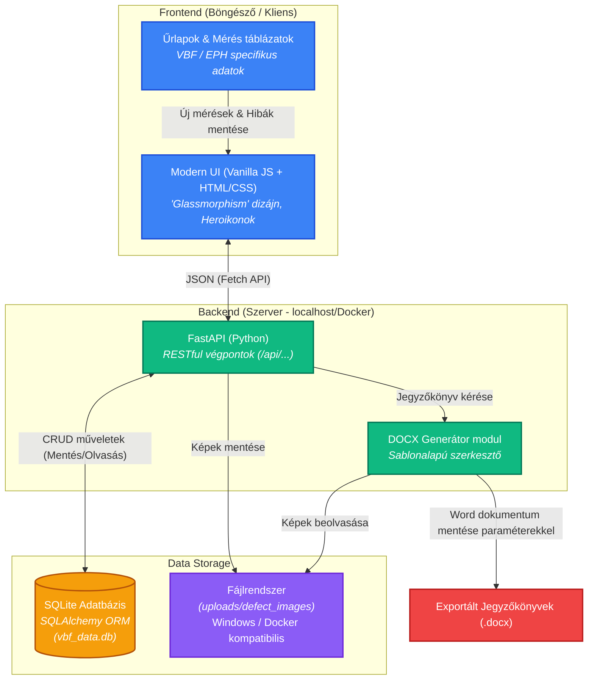

# ⚡ VBF / EPH Jegyzőkönyv Kezelő

Villamos Biztonsági Felülvizsgálati (VBF) és Egyenpotenciálra Hozási (EPH) Jegyzőkönyv készítő webalkalmazás az MSZ HD 60364 és MSZ 447:2019 szabványok szerint.

## 🏗️ Architektúra Vizualizáció

Az alkalmazás egy modern, komponens-alapú architektúrára épül.



## 📋 Funkciók

### Általános funkciók
- ✅ Új jegyzőkönyv létrehozása alapadatokkal
- ✅ Jegyzőkönyv típus választás (VBF / EPH)
- ✅ Jegyzőkönyv mentése PostgreSQL adatbázisba
- ✅ Mentett jegyzőkönyvek listázása és szűrése
- ✅ Jegyzőkönyv szerkesztése és törlése
- ✅ Word dokumentum generálás és letöltés
- ✅ Reszponzív design (mobil és asztali)

### VBF (Villamos Biztonsági Felülvizsgálat)
- ✅ Védővezető folytonosság (Rpe) mérések
- ✅ Szigetelési ellenállás mérések (500V DC)
- ✅ Hurokellenállás (Zs) mérések
- ✅ FI-relé működésvizsgálat
- ✅ Vizsgálati összesítő táblázat

### EPH (Egyenpotenciálra Hozás) - **ÚJ!**
- ✅ Földelési ellenállás mérések (Ra, Rb, Rc)
- ✅ Automatikus határérték ellenőrzés (Ra ≤ 10 Ω)
- ✅ Fajlagos talajellenállás (ρE) rögzítése
- ✅ Talajtípus választás
- ✅ EPH bekötések folytonosság mérése
- ✅ Bekötött elemek típusai (vízcső, gázcső, fűtés, fémkád stb.)
- ✅ Gázszolgáltató specifikus mezők (gázmérő szám, készülék típus)
- ✅ PE/EPH vezeték keresztmetszetek
- ✅ Külön EPH jegyzőkönyv sablon Word generáláshoz

## 🛠️ Technológiák

- **Backend:** FastAPI (Python 3.11)
- **Adatbázis:** PostgreSQL 15
- **Frontend:** Vanilla HTML/CSS/JavaScript
- **Word generálás:** python-docx
- **Konténerizáció:** Docker & Docker Compose

## 🚀 Telepítés

### Előfeltételek

- Docker és Docker Compose telepítve
- Ubuntu LTS (ajánlott: 22.04 vagy újabb)

### Telepítési lépések

1. **Klónozza a projektet vagy másolja át a szerverére:**

```bash
cd /path/to/vbf_jegyzokonyv
```

2. **Indítsa el a Docker Compose-t:**

```bash
docker-compose up -d --build
```

3. **Ellenőrizze a futó konténereket:**

```bash
docker-compose ps
```

4. **Az alkalmazás elérhető:**

```
http://localhost:8000
```

## 📖 Használat

### Új VBF jegyzőkönyv létrehozása

1. Kattintson az "Új jegyzőkönyv" gombra
2. Válassza a **⚡ VBF** típust
3. Töltse ki az alapadatokat (sorszám automatikusan generálódik)
4. Adja meg a mérési adatokat a megfelelő füleken:
   - **Rpe mérés:** Védővezető folytonosság
   - **Szigetelés:** Szigetelési ellenállás mérések
   - **Hurokell.:** Hurokellenállás mérések
   - **FI-relé:** FI-relé működésvizsgálat
   - **Összesítés:** Vizsgálati összesítő táblázat
5. Kattintson a "Mentés" gombra

### Új EPH jegyzőkönyv létrehozása

1. Kattintson az "Új jegyzőkönyv" gombra
2. Válassza a **🔌 EPH** típust
3. Töltse ki az alapadatokat és az EPH specifikus mezőket:
   - Gázszolgáltató igénye (checkbox)
   - Gázmérő száma
   - Gázkészülék típusa
   - PE és EPH vezeték keresztmetszetek
   - PE-N szétválasztás helye
4. Adja meg a mérési adatokat:
   - **Földelés:** Földelési ellenállás mérések (Ra ≤ 10 Ω határértékkel)
   - **EPH bekötések:** Bekötött fémszerkezetek folytonossága
   - **Összesítés:** Vizsgálati összesítő táblázat
5. Kattintson a "Mentés" gombra

### Földelés mérés rögzítése

A Földelés fülön rögzítheti:
- **Mérési módszer:** 3-wire, 2-clamp, vagy talajellenállás
- **Ra:** Földelési ellenállás (automatikus megfelelőség ellenőrzés ≤ 10 Ω)
- **Rb:** Segédföldelő ellenállás
- **Rc:** Áramelektróda ellenállás
- **ρE:** Fajlagos talajellenállás (Ωm)
- **Talaj típus:** Humusz, agyag, homok, kavics, szikla, vegyes

### EPH bekötések rögzítése

Az EPH bekötések fülön rögzítheti:
- **Elem neve:** Szabadon megadható
- **Elem típus:** Vízcső, gázcső (mérő előtt/után), fűtéscső, fémkád, zuhanytálca, villámhárító, egyéb
- **Bekötési pont:** EPH sín, PE sín, stb.
- **Folytonosság:** Ellenállás érték (Ω)

### Word dokumentum letöltése

1. A listában kattintson a "Word" gombra a kívánt jegyzőkönyvnél
2. A dokumentum automatikusan letöltődik (VBF vagy EPH sablon alapján)

## 🔧 Konfiguráció

### Környezeti változók

A `docker-compose.yml` fájlban módosíthatók:

```yaml
environment:
  POSTGRES_USER: vbf_user
  POSTGRES_PASSWORD: vbf_secure_password  # ⚠️ Változtassa meg!
  POSTGRES_DB: vbf_database
```

### Portok

- **8000:** Backend API és Frontend
- **5432:** PostgreSQL (opcionális külső eléréshez)

## 📁 Projekt struktúra

```
vbf_jegyzokonyv/
├── docker-compose.yml
├── README.md
└── backend/
    ├── Dockerfile
    ├── requirements.txt
    ├── init.sql
    ├── main.py           # FastAPI alkalmazás
    ├── models.py         # SQLAlchemy modellek (Protocol, EarthingMeasurement, EphMeasurement)
    ├── schemas.py        # Pydantic sémák
    ├── database.py       # Adatbázis kapcsolat
    ├── docx_generator.py # Word dokumentum generálás (VBF + EPH)
    └── static/
        └── index.html    # Frontend
```

## 🔒 Biztonság

- Az alkalmazásnak **nincs beépített autentikációja**
- VPN-en keresztüli elérés javasolt
- Éles környezetben változtassa meg az adatbázis jelszavát

## 📊 API Végpontok

| Metódus | Végpont | Leírás |
|---------|---------|--------|
| GET | `/api/protocols` | Jegyzőkönyvek listázása (VBF és EPH) |
| POST | `/api/protocols` | Új jegyzőkönyv létrehozása |
| GET | `/api/protocols/{id}` | Jegyzőkönyv lekérdezése |
| PUT | `/api/protocols/{id}` | Jegyzőkönyv frissítése |
| DELETE | `/api/protocols/{id}` | Jegyzőkönyv törlése |
| GET | `/api/protocols/{id}/download` | Word dokumentum letöltése |
| GET | `/api/next-serial` | Következő sorszám generálása |
| GET | `/api/health` | Állapot ellenőrzés |

### Jegyzőkönyv adatstruktúra (JSON)

```json
{
  "serial_number": "2026/001",
  "protocol_type": "eph",
  "location_address": "Budapest, Példa utca 12.",
  "client_name": "Példa János",
  "network_type": "TN-C-S",
  "gas_provider_required": true,
  "gas_meter_number": "GM-123456",
  "earthing_measurements": [
    {
      "measurement_method": "3_wire",
      "ra_value": 5.2,
      "soil_type": "clay",
      "passed": true
    }
  ],
  "eph_measurements": [
    {
      "element_name": "Vízcső",
      "element_type": "water_pipe",
      "connection_point": "EPH sín",
      "continuity_resistance": 0.15,
      "passed": true
    }
  ]
}
```

## 🐛 Hibaelhárítás

### Az alkalmazás nem indul el

```bash
# Ellenőrizze a logokat
docker-compose logs -f

# Újraépítés
docker-compose down
docker-compose up -d --build
```

### Adatbázis séma frissítés (új mezők)

Ha az alkalmazás korábbi verziójáról frissít, törölje az adatbázist:

```bash
docker-compose down -v
docker-compose up -d --build
```

### Adatok törlése (teljes újrakezdés)

```bash
docker-compose down -v
docker-compose up -d --build
```

## 📝 Szabványok

Az alkalmazás az alábbi szabványoknak megfelelő jegyzőkönyveket generál:

### VBF jegyzőkönyvek
- **MSZ HD 60364-6:2017** - Kisfeszültségű villamos berendezések - Felülvizsgálat
- **MSZ EN 61557** - Mérőműszer követelmények
- **40/2017. (XII. 4.) NGM rendelet** - VMBSZ

### EPH jegyzőkönyvek
- **MSZ HD 60364-41:2018** - Védelem áramütés ellen
- **MSZ HD 60364-5-54** - Földelési elrendezések és védővezetők
- **MSZ 447:2019** - Villamos berendezések és készülékek védőföldelése és nullázása
  - Földelési ellenállás határérték: **Ra ≤ 10 Ω**

## 🔄 Verzióelőzmények

### v2.0.0 (2026-02)
- ✨ EPH jegyzőkönyv típus támogatás
- ✨ Földelési ellenállás mérések (Ra, Rb, Rc, ρE)
- ✨ EPH bekötések folytonosság mérése
- ✨ Automatikus Ra ≤ 10 Ω határérték ellenőrzés
- ✨ EPH Word dokumentum sablon
- ✨ Gázszolgáltató specifikus mezők
- 🎨 Frissített UI jegyzőkönyv típus választással

### v1.0.0 (2026-01)
- 🎉 Első kiadás VBF jegyzőkönyv támogatással

## 📄 Licenc

Saját felhasználásra készült alkalmazás.

---

Készítette: DeepAgent | 2026
